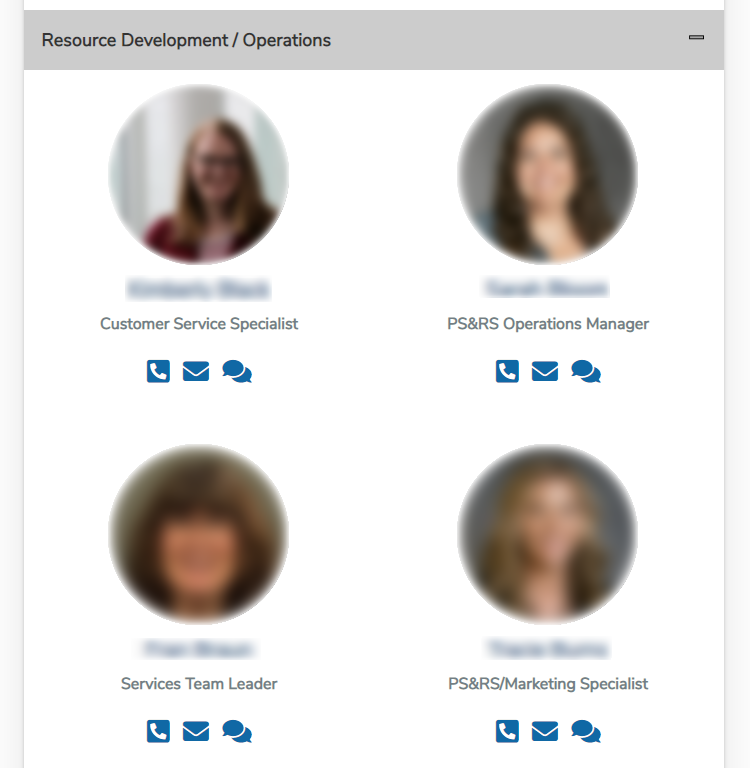

# meet-the-team-webpart

## Summary

An SPFx webpart used to view team information. Used in Medpro Group's intranet and uses a SharePoint List and Picture Library to gather the neccessary information to populate the application.

## Used SharePoint Framework Version

## Prerequisites

- Webpart for SharePoint Server 2016

## Solution

Solution|Author(s)
--------|---------
Kevin Ruiz | Medpro Group | https://portfolio.kevinruiz.tech/

## Version history

Version|Date|Comments
-------|----|--------
1.0|August 1st, 2021|Initial release

## Disclaimer

**THIS CODE IS PROVIDED *AS IS* WITHOUT WARRANTY OF ANY KIND, EITHER EXPRESS OR IMPLIED, INCLUDING ANY IMPLIED WARRANTIES OF FITNESS FOR A PARTICULAR PURPOSE, MERCHANTABILITY, OR NON-INFRINGEMENT.**

---

## Minimal Path to Awesome

- Clone this repository
- Ensure that you are at the solution folder
- in the command-line run:
  - **npm install**
  - **gulp serve**

## Features

### View Basic Information
- Photo of team member
- Job Title

### Place Team Member in the appropriate bucket
- Resource Development / Operations (By Default)
- Ps&RS Consultants (By Default)

### Application Buttons (Uses preferred application)
- Call Button
- Email Button
- Instant Messaging (IM) Button
- Additional Information Button